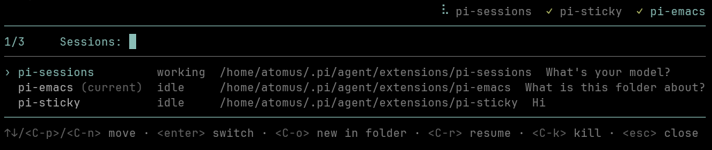

# pi-sessions

`pi-sessions` turns one Pi process into an in-process live-session multiplexer.

Multiple Pi sessions can stay alive concurrently. Exactly one session owns the terminal at a time. Switching away stops only the inactive TUI, with its agent runtime still running in background.



## Install

```bash
pi install npm:pi-parallel-sessions
```

Or install directly from GitHub:

```bash
pi install git:github.com/liushihao456/pi-sessions@v0.2.0
```

## Command

Only one slash command is exposed:

- `/sessions` — open the session switcher.

Shortcut:

- `Ctrl-R` — open the same session switcher without typing `/sessions`.

All session operations happen inside that switcher.

## Switcher keys

- type normally — filter live sessions.
- `↑` / `↓` or `Ctrl-P` / `Ctrl-N` — move selection.
- `Enter` — switch to selected live session. Selecting `parent` switches back to parent.
- `Ctrl-O` — open `FileExplorer`; selecting a folder creates a new child session in that folder and switches to it.
- `Ctrl-R` — open a one-off resume flow; selecting a saved Pi session opens it as a live child and switches to it.
- `Ctrl-K` — stop selected live child session.
- `Esc` — close switcher.

## Runtime model

```text
parent Pi process
  └─ pi-sessions live-session multiplexer
      ├─ parent: existing InteractiveMode
      ├─ child A: AgentSessionRuntime + InteractiveMode
      ├─ child B: AgentSessionRuntime + InteractiveMode
      └─ child C: AgentSessionRuntime + InteractiveMode
```

Child sessions are real native `InteractiveMode` instances, not embedded panels. When active, child UI is full-screen and native Pi slash-command UI works as usual.

`/quit` keeps native behavior and exits the whole Pi process.

## Path locks

All live sessions share one in-process lock manager. Before write/edit/mutating shell tools run, `pi-sessions` checks for conflicting path locks and blocks conflicting writes.

This prevents two live sessions from editing the same path tree at once.
